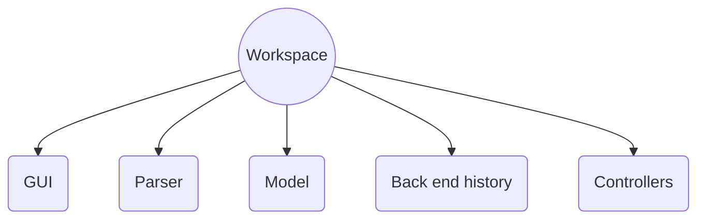

For today's refactoring session, we decided to make several changes to make our code more flexible and readable. 

Edward Zhuang and Andy Nguyen worked primarily on refactoring the Controller class, a class which previously acted as a "God class". Though it's primary purpose was to link the front end view with the back end model, the Controller ended up with too many tasks. In addition to initializing the GUI along with all of its screen components, the Controller also handled all front end commands and relayed them to a single Parser. While our program runs successfully, we have identified this class as a critical bottleneck which would hinder the flexibility of our design. To mitigate this problem, we brainstormed ways we could break down the Controller class, considering factors such as Parser interaction and back end access. This proved to be a difficult task, as many the various screen components had unique overlaps of required variables and methods. Ultimately, we decided to separate the Controller into several smaller ones, and these controllers would each be responsible for a specific screen component (ex. Drawer would have a DrawerController). Since many of the new Controllers would require the same instances of back end objects (ex. Parser), we made a higher "Workspace" class which would hold all back end objects and controllers. 

For the Controllers, we created an abstract Controller class which contained universal methods such as initializeScreenComponent(). We then made a subclass Controller for each screen component, and gave each one specific variables and constructors relevant to their purpose. Finally, we implemented various interfaces which provided back end interaction functionality for these controllers.

Overall, this refactoring session was very beneficial in removing bottlenecks from our code design.

Belanie worked on refactoring the parser class and made some commits to her current branch, bn51.2.0, however was not successful in refactoring her code in a way that still allowed it to be functional. She tried to move the node making out of the parser class, but had too many dependencies to completely remove it. She hopes to refactor the parser class as part of her masterpiece. 